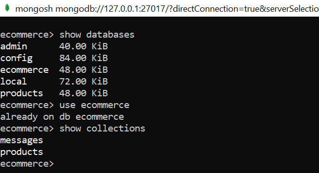
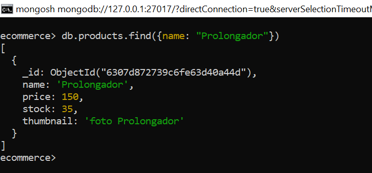
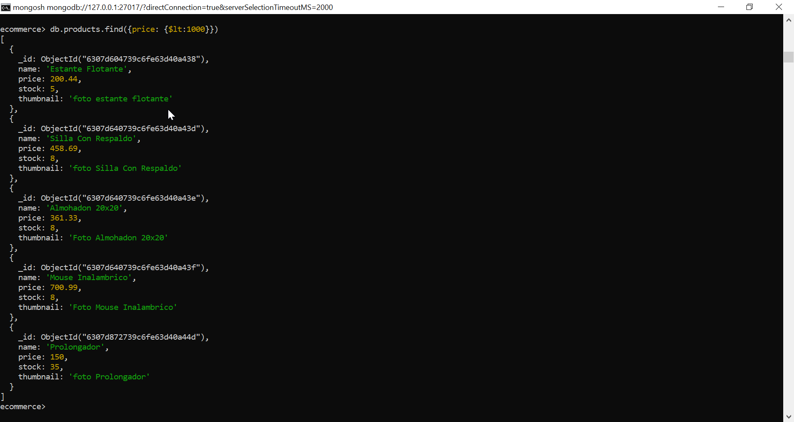
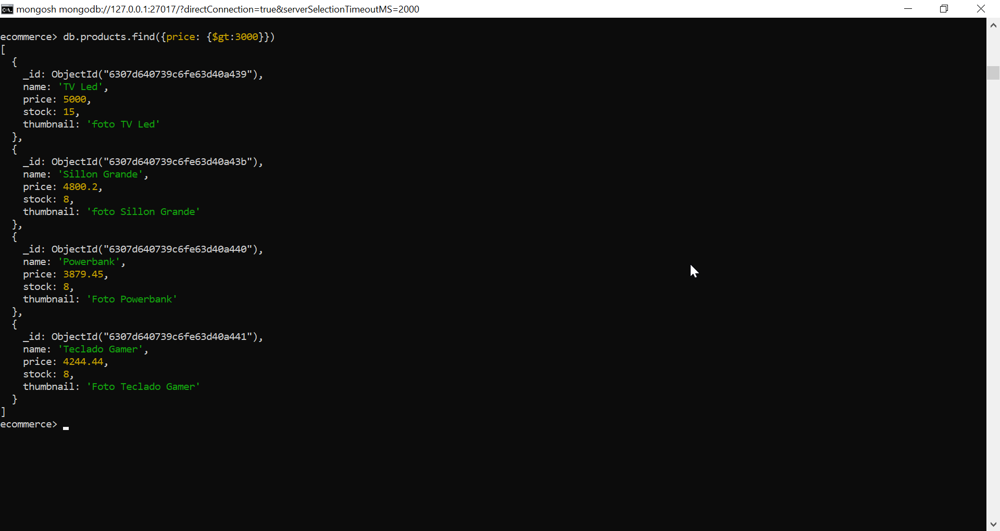
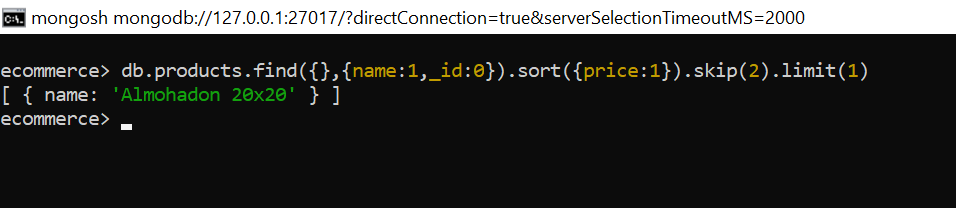

<h1>1- Agregar 10 documentos con valores distintos a las colecciones mensajes y productos. 
El formato de los documentos debe estar en correspondencia con el que venimos utilizando
 en el entregable con base de datos MariaDB. </h1>

<H1>
// 2- Vamos a tener una colección de productos, donde hay que poner valores al campo precio
// entre los 100 y 5000 pesos(eligiendo valores intermedios, ej: 120, 580, 900, 1280, 1700, 2300, 2860, 3350, 4320, 4990).</h1>

    db.products.insertOne({name: "Estante Flotante", price: 200.44 , stock: 5,thumbnail: "foto estante flotante"})
    db.products.insertMany([{name: "TV Led", price: 5000.00 , stock: 15,thumbnail: "foto TV Led"},{name: "Mesa Ratona", price: 1300.00 , stock: 35,thumbnail: "foto Mesa Ratona"},{name: "Sillon Grande", price: 4800.20 , stock: 8,thumbnail: "foto Sillon Grande"},{name: "Mesa Comedor", price: 2838.69 , stock: 8,thumbnail: "foto Mesa Comedor"},{name: "Silla Con Respaldo", price: 458.69 , stock: 8,thumbnail: "foto Silla Con Respaldo"},{name: "Almohadon 20x20", price: 361.33 , stock: 8,thumbnail: "Foto Almohadon 20x20"},{name: "Mouse Inalambrico", price: 700.99 , stock: 8,thumbnail: "Foto Mouse Inalambrico"},{name: "Powerbank", price: 3879.45 , stock: 8,thumbnail: "Foto Powerbank"},{name: "Teclado Gamer", price: 4244.44 , stock: 8,thumbnail: "Foto Teclado Gamer"}])

    db.messages.insertMany([{userName: "Laura",
    date: "20/04/2022 23:10:51",
    message: "Hola"
    },
    {
    userName: "Mateo",
    date: "20/04/2022 23:11:15",
    message: "Como estas?"
    },
    {
    userName: "Rodrigo",
    date: "20/04/2022 23:11:53",
    message: "Buenas tardes"
    },
    {
    userName: "Jess",
    date: "21/04/2022 02:41:28",
    message: "Bien, uds?"
    },
    {
    userName: "riquelme182",
    date: "21/04/2022 02:41:45",
    message: "Heyyyyyy!!!!"
    },
    {
    userName: "Laura",
    date: "20/04/2022 23:10:51",
    message: "Bienvenidos"
    },
    {
    userName: "Mateo",
    date: "20/04/2022 23:11:15",
    message: "aburrido"
    },
    {
    userName: "panteraRosa",
    date: "20/04/2022 23:11:53",
    message: "buuuuuu!"
    },
    {
    userName: "Cr7",
    date: "21/04/2022 02:41:28",
    message: "siiiiiiiiiiiuuuuuuuuuuuuuuuuu!!!!"
    },
    {
    userName: "riquelme182",
    date: "21/04/2022 02:41:45",
    message: "Aguante Boquita"
    },
    {
    userName: "LuqitasRodriguez",
    date: "21/04/2022 02:41:45",
    message: "Vamos por la septima"
    }])

<h1>3 - Listar todos los documentos en cada colección.</h1>

    db.products.find()
    db.messages.find()

<h1> 4- Mostrar la cantidad de documentos almacenados en cada una de ellas. </h1>

    db.products.countDocuments()
    db.messages.countDocuments()

<h1> 5- Realizar un CRUD sobre la colección de productos: </h1>

<h2> 5.1- Agregar un producto más en la colección de productos </h2>

    db.products.insertOne({name: "Prolongador", price: 150.00 , stock: 35,thumbnail: "foto Prolongador"})

<h2>5.2-   Realizar una consulta por nombre de producto específico: </h2>
    db.products.find({name: "Prolongador"})

<h2>  A. Listar los productos con precio menor a 1000 pesos. </h2>

    db.products.find({price: {$lt:1000}})

<h2>  B. Listar los productos con precio entre los 1000 a 3000 pesos. </h2>

    db.products.find({price: {$gte:100, $lte:3000}})

<h2>  C. Listar los productos con precio mayor a 3000 pesos. </h2>

    db.products.find({price: {$gt:3000}})

<h2> D- Realizar una consulta que traiga sólo el nombre del tercer producto más barato. </h2>

    db.products.find({},{name:1,_id:0}).sort({price:1}).skip(2).limit(1)

<h2> 5.3- Hacer una actualización sobre todos los productos,  
 agregando el campo stock a todos ellos con un valor de 100. </h2>

    db.products.updateMany({stock: {$exists:true}},{$set:{stock:100}})
    db.products.find()

<h2> 5.4- Cambiar el stock a cero de los productos con precios mayores a 4000 pesos. </h2>

    db.products.updateMany({price: {$gt:400}},{$set:{stock:0}})
    db.products.find({price: {$gt:400}})

    
<h2> 5.5- Borrar los productos con precio menor a 1000 pesos </h2>

    db.poducts.find({price: {$lt:1000}})
    db.poducts.deleteMany({price: {$lt:1000}})
    db.poducts.find({price: {$lt:1000}})

